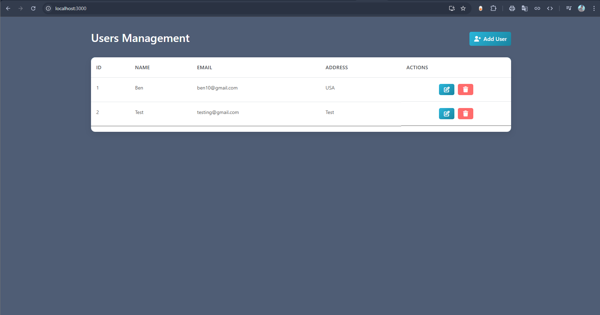
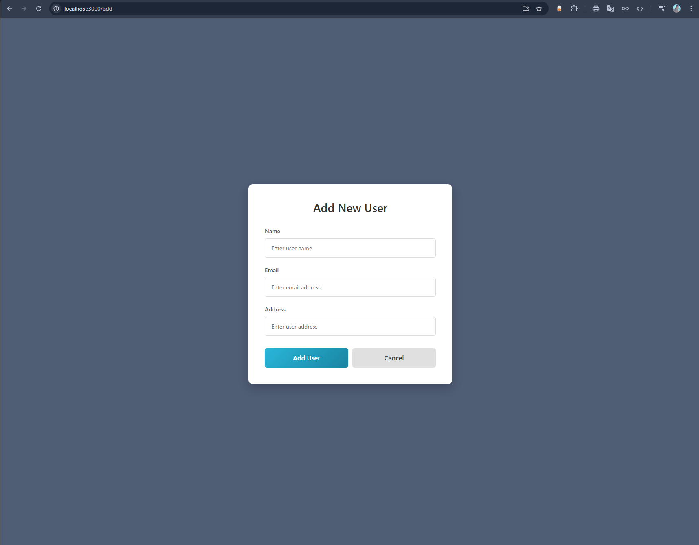
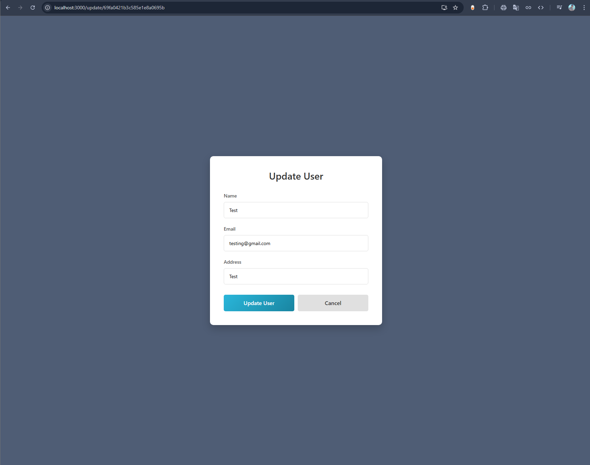
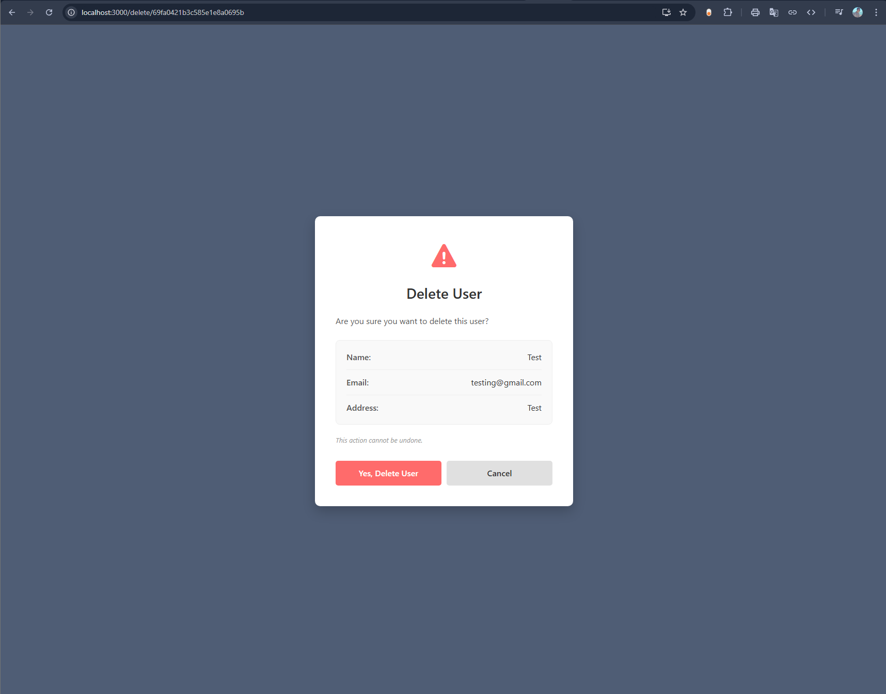

<<<<<<< HEAD
# MERN Stack User Management CRUD Application

A full-stack MERN (MongoDB, Express.js, React.js, Node.js) CRUD application for managing users.  
This project allows users to create, read, update, and delete user records through a modern responsive interface connected to a RESTful API.

Built by following and extending concepts from a MERN Stack tutorial/project series.

---

## Features

### Frontend

- Responsive React.js user interface
- Add new users
- View all users
- Update existing user information
- Delete users with confirmation page
- React Router navigation
- Axios API communication
- Custom modern CSS styling
- Mobile responsive layout

### Backend

- RESTful API with Express.js
- MongoDB database integration using Mongoose
- User schema validation
- Error handling
- Duplicate email prevention
- CORS enabled
- Environment variable support with dotenv

---

# Error Handling

The application handles:

- Duplicate email validation
- Missing users
- Database connection errors
- Invalid requests
- Empty user collections

---

# Tech Stack

## Frontend

- React.js
- React Router DOM
- Axios
- Bootstrap
- CSS3

## Backend

- Node.js
- Express.js
- MongoDB
- Mongoose
- dotenv
- cors

---

# Main Project Structure

```bash
project-root/
│
├── server/
│   ├── controller/
│   │   └── userController.js
│   │
│   ├── model/
│   │   └── userModel.js
│   │
│   ├── routes/
│   │   └── userRoute.js
│   │
│   ├── .env
│   ├── index.js
│   └── package.json
│
├── client/
│   ├── src/
│   │   ├── addUser/
│   │   ├── deleteUser/
│   │   ├── getUser/
│   │   ├── updateUser/
│   │   ├── App.js
│   │   ├── App.css
│   │   └── index.js
│   │
│   └── package.json
│
└── README.md
```

---

# Prerequisites

Before running this project, make sure you have installed:

- Node.js
- npm
- local MongoDB database
- Git
- Code editor, recommended VS Code

You also need a MongoDB connection string.

Create a `.env` file inside the `server` folder:

```env
PORT = 8000
MONGO_URL = your_mongodb_connection_string
```

---

# Installation Guide

## 1. Clone Repository

```bash
git clone https://github.com/IgnasValiukas/MERN-APP.git
```

---

## 2. Install Backend Dependencies

```bash
cd server
npm install
```

---

## 3. Install Frontend Dependencies

Open a new terminal:

```bash
cd client
npm install
```

---

# Running The Application

## Start Backend Server

```bash
npm start
```

If `npm start` does not work, run:

```bash
node index.js
```

The backend server should run on:

```bash
http://localhost:8000
```

## Start Frontend Application

Open another terminal inside the `client` folder:

```bash
cd client
npm start
```

The frontend should open on:

```bash
http://localhost:3000
```

---

# Important Notes

- The backend must be running before using the frontend.
- Make sure your MongoDB connection string is correct.
- Make sure the `.env` file is inside the `server` folder.
- If dependencies are missing, run `npm install` in both `server` and `client` folders.

---

# Example User Object

```json
{
  "name": "John Doe",
  "email": "john@example.com",
  "address": "New York"
}
```

---

# Screenshots

## Home Page



## Add User Page



## Update User Page



## Delete Confirmation Page



---

# Author

Developed by Ignas Val

GitHub:
https://github.com/IgnasValiukas

---
=======
# MERN-APP
A full-stack MERN (MongoDB, Express.js, React.js, Node.js) CRUD application for managing users.   This project allows users to create, read, update, and delete user records through a modern responsive interface connected to a RESTful API.
>>>>>>> 466783d6f16bc4bd5219d44068cb80a892533add
